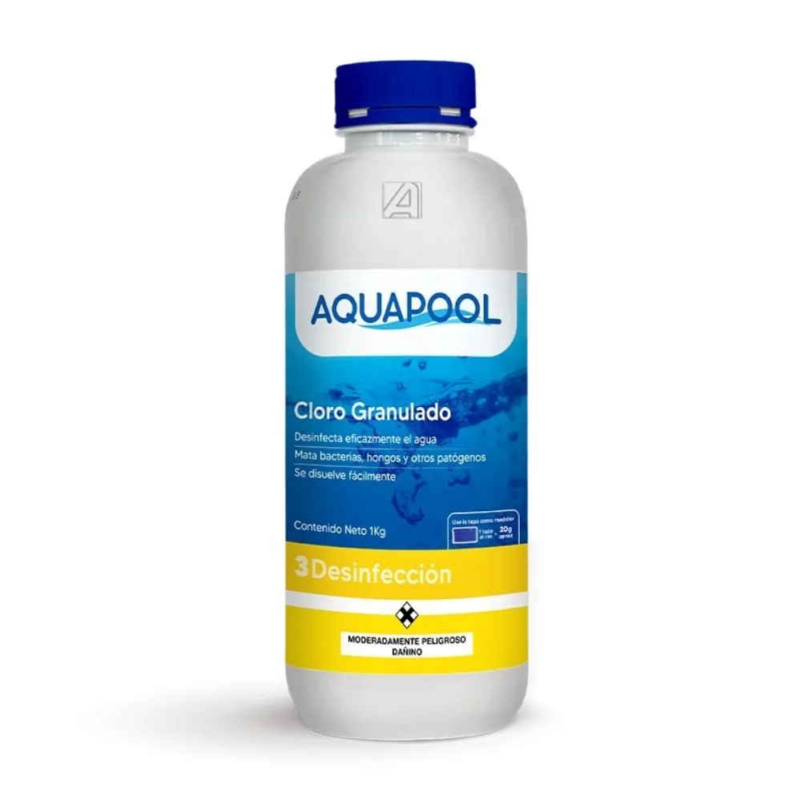
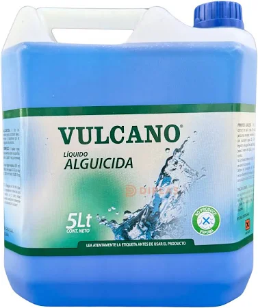

#### puedes borrar todos los comentarios del codigo  

¡Claro! Entendido. Eliminaré todos los comentarios del archivo `main_page.html`.

Aquí tienes el contenido actualizado del archivo:

main_page.html
```html
<!DOCTYPE html>
<html lang="es">
<head>
  <meta charset="UTF-8">
  <meta name="viewport" content="width=device-width, initial-scale=1.0">
  <title>Piscinas Splash</title>
  <style>
    * {
      box-sizing: border-box;
      font-family: 'Segoe UI', Roboto, 'Helvetica Neue', Arial, sans-serif;
      margin: 0;
      padding: 0;
    }

    body {
      background-color: #f0f2f5;
      color: #333;
      line-height: 1.6;
    }

    .container {
      max-width: 1000px;
      margin: auto;
      padding: 20px;
    }

    .card {
      background-color: white;
      border-radius: 16px;
      padding: 24px;
      margin-top: 20px;
      box-shadow: 0 6px 20px rgba(0, 0, 0, 0.08);
      transition: transform 0.3s ease, box-shadow 0.3s ease;
    }
    .card:hover {
        transform: translateY(-3px);
        box-shadow: 0 8px 25px rgba(0, 0, 0, 0.12);
    }

    .login-bg {
      background: url('https://images.unsplash.com/photo-1600051793740-22a941f60d3b') no-repeat center/cover;
      border-radius: 16px 16px 0 0;
      height: 200px;
      display: flex;
      align-items: center;
      justify-content: center;
      color: white;
      text-shadow: 1px 1px 5px rgba(0,0,0,0.8);
    }

    h1 {
      font-size: 2.8em;
      letter-spacing: -0.02em;
    }

    h2 {
      margin: 16px 0 24px;
      color: #0077cc;
      border-bottom: 2px solid #e0e6eb;
      padding-bottom: 12px;
      font-size: 1.8em;
    }

    input, select, textarea {
      width: 100%;
      padding: 12px;
      border-radius: 8px;
      border: 1px solid #d0d5db;
      margin-bottom: 15px;
      font-size: 1em;
      transition: border-color 0.3s ease, box-shadow 0.3s ease;
    }

    input:focus, select:focus, textarea:focus {
      border-color: #00aaff;
      box-shadow: 0 0 0 3px rgba(0, 170, 255, 0.2);
      outline: none;
    }

    .btn {
      width: 100%;
      background-color: #00aaff;
      border: none;
      color: white;
      padding: 14px;
      border-radius: 8px;
      cursor: pointer;
      font-weight: bold;
      margin-bottom: 10px;
      transition: background-color 0.3s ease, transform 0.2s ease, box-shadow 0.3s ease;
      font-size: 1.05em;
      box-shadow: 0 4px 10px rgba(0, 170, 255, 0.2);
    }

    .btn:hover {
      background-color: #008ecc;
      transform: translateY(-2px);
      box-shadow: 0 6px 15px rgba(0, 170, 255, 0.3);
    }

    .btn:active {
        transform: translateY(0);
        box-shadow: 0 2px 5px rgba(0, 170, 255, 0.2);
    }

    .btn-secondary {
      background-color: #6c757d;
      box-shadow: 0 4px 10px rgba(108, 117, 125, 0.2);
    }

    .btn-secondary:hover {
      background-color: #5a6268;
      box-shadow: 0 6px 15px rgba(108, 117, 125, 0.3);
    }

    .btn-danger {
      background-color: #dc3545;
      box-shadow: 0 4px 10px rgba(220, 53, 69, 0.2);
    }

    .btn-danger:hover {
      background-color: #c82333;
      box-shadow: 0 6px 15px rgba(220, 53, 69, 0.3);
    }

    .link {
      display: block;
      text-align: center;
      margin-top: 15px;
      color: #0077cc;
      text-decoration: none;
      font-size: 0.95em;
      transition: color 0.3s ease;
    }

    .link:hover {
        color: #005f99;
        text-decoration: underline;
    }

    .hidden {
      display: none !important;
    }

    .row {
      display: flex;
      align-items: center;
      gap: 15px;
    }

    .grid {
      display: grid;
      grid-template-columns: repeat(auto-fit, minmax(280px, 1fr));
      gap: 25px;
      margin-top: 25px;
    }

    .nav-bar {
      display: flex;
      flex-wrap: wrap;
      justify-content: center;
      background-color: #0077cc;
      padding: 10px;
      border-radius: 8px;
      margin-bottom: 25px;
      box-shadow: 0 4px 12px rgba(0,0,0,0.15);
    }

    .nav-bar button {
      background: none;
      border: none;
      color: white;
      padding: 12px 18px;
      cursor: pointer;
      font-weight: bold;
      font-size: 1.05em;
      border-radius: 6px;
      transition: background-color 0.3s ease, transform 0.2s ease;
      margin: 5px;
    }

    .nav-bar button:hover, .nav-bar button.active {
      background-color: #005f99;
      transform: translateY(-2px);
    }
    .nav-bar button.active {
        box-shadow: inset 0 0 0 2px rgba(255,255,255,0.5);
    }

    table {
      width: 100%;
      border-collapse: collapse;
      margin-top: 20px;
      background-color: white;
      border-radius: 10px;
      overflow: hidden;
      box-shadow: 0 2px 8px rgba(0,0,0,0.08);
    }

    th, td {
      padding: 14px 18px;
      text-align: left;
      border-bottom: 1px solid #eef2f5;
    }

    th {
      background-color: #f8f9fa;
      font-weight: bold;
      color: #555;
      text-transform: uppercase;
      font-size: 0.9em;
    }

    tr:last-child td {
      border-bottom: none;
    }

    tr:nth-child(even) {
        background-color: #fdfdfd;
    }

    tr:hover {
        background-color: #eef7ff;
        transition: background-color 0.2s ease;
    }

    .table-actions button {
      padding: 8px 12px;
      margin-right: 8px;
      font-size: 0.8em;
      width: auto;
      border-radius: 6px;
    }

    .stat-box {
      background: #e0f7ff;
      border-radius: 12px;
      padding: 20px;
      margin-bottom: 15px;
      box-shadow: 0 4px 12px rgba(0,0,0,0.08);
      text-align: center;
    }

    .stat-title {
      font-weight: bold;
      margin-bottom: 8px;
      color: #005f99;
      font-size: 1.1em;
    }
    .stat-box div:last-child {
        font-size: 1.8em;
        font-weight: bold;
        color: #0077cc;
    }

    .product-img {
      width: 60px;
      height: 60px;
      border-radius: 8px;
      object-fit: cover;
      margin-right: 15px;
      border: 1px solid #e0e6eb;
    }

    .product-card {
      background-color: white;
      border-radius: 16px;
      padding: 20px;
      box-shadow: 0 4px 15px rgba(0,0,0,0.1);
      text-align: center;
      transition: transform 0.3s ease, box-shadow 0.3s ease;
    }

    .product-card:hover {
      transform: translateY(-8px);
      box-shadow: 0 8px 25px rgba(0,0,0,0.15);
    }

    .product-card img {
      width: 100%;
      height: 180px;
      object-fit: cover;
      border-radius: 12px;
      margin-bottom: 15px;
      border: 1px solid #f0f2f5;
    }

    .product-card h3 {
      font-size: 1.3em;
      margin-bottom: 8px;
      color: #0077cc;
    }

    .product-card .price {
      font-size: 1.2em;
      font-weight: bold;
      color: #00aaff;
      margin-bottom: 15px;
    }

    .product-card .description {
      font-size: 0.95em;
      color: #666;
      height: 70px;
      overflow: hidden;
      text-overflow: ellipsis;
      margin-bottom: 15px;
    }

    .product-card .btn {
        margin-top: 10px;
    }

    .calendar-grid {
      display: grid;
      grid-template-columns: repeat(7, 1fr);
      gap: 8px;
      margin-top: 25px;
      background-color: white;
      border-radius: 12px;
      padding: 15px;
      box-shadow: 0 2px 8px rgba(0,0,0,0.08);
    }

    .calendar-day {
      background-color: #f6f9fc;
      border-radius: 10px;
      padding: 12px;
      min-height: 120px;
      font-size: 0.9em;
      border: 1px solid #eef2f5;
      display: flex;
      flex-direction: column;
      gap: 5px;
    }

    .calendar-day.today {
      border: 2px solid #00aaff;
      background-color: #e0f7ff;
      box-shadow: 0 0 0 2px rgba(0, 170, 255, 0.3);
    }

    .calendar-day-header {
      font-weight: bold;
      text-align: center;
      padding: 10px;
      background-color: #0077cc;
      color: white;
      border-radius: 10px 10px 0 0;
      grid-column: span 7;
      margin-bottom: 10px;
      font-size: 1.1em;
    }

    .calendar-day-number {
      font-weight: bold;
      font-size: 1.3em;
      margin-bottom: 5px;
      color: #0077cc;
    }

    .calendar-event {
      background-color: #d4edda;
      color: #155724;
      border-radius: 6px;
      padding: 6px 10px;
      margin-bottom: 5px;
      font-size: 0.85em;
      white-space: nowrap;
      overflow: hidden;
      text-overflow: ellipsis;
      box-shadow: 0 1px 3px rgba(0,0,0,0.05);
    }

    .form-section {
      background-color: #f6f9fc;
      border-radius: 16px;
      padding: 25px;
      margin-top: 25px;
      box-shadow: inset 0 1px 5px rgba(0,0,0,0.08);
    }

    .form-section h3 {
      margin-top: 0;
      color: #0077cc;
      margin-bottom: 20px;
      font-size: 1.5em;
    }

    .form-actions {
      display: flex;
      gap: 15px;
      justify-content: flex-end;
      margin-top: 20px;
    }

    .form-actions .btn {
      width: auto;
      min-width: 120px;
      padding: 10px 20px;
    }

    @media (max-width: 768px) {
      .container {
        padding: 15px;
      }
      .nav-bar {
        flex-direction: column;
        align-items: stretch;
        padding: 5px;
      }
      .nav-bar button {
        margin: 5px 0;
        padding: 10px;
      }
      .grid {
        grid-template-columns: 1fr;
        gap: 15px;
      }
      .calendar-grid {
        grid-template-columns: repeat(auto-fit, minmax(80px, 1fr));
        gap: 3px;
        padding: 8px;
      }
      .calendar-day {
        min-height: 70px;
        padding: 8px;
      }
      .calendar-day-number {
        font-size: 1em;
      }
      .calendar-event {
        font-size: 0.75em;
        padding: 3px 5px;
      }
      h1 {
        font-size: 2em;
      }
      h2 {
        font-size: 1.5em;
      }
      .product-card img {
        height: 120px;
      }
    }
  </style>
</head>
<body>
  <div class="container">
    <div class="card" id="login-section">
      <div class="login-bg">
        <h1>Piscinas Splash</h1>
      </div>
      <h2>Bienvenido</h2>
      <input type="text" placeholder="Nombre de usuario" id="username-input">
      <input type="password" placeholder="Contraseña" id="password-input">
      <button class="btn" onclick="login()">Iniciar sesión</button>
      <a class="link" href="#">¿Olvidaste tu contraseña?</a>
      <a class="link" href="#">¿No tienes una cuenta?</a>
    </div>

    <div id="app-content" class="hidden">
      <div class="nav-bar">
        <button id="nav-dashboard" onclick="showSection('dashboard-section')">Dashboard</button>
        <button id="nav-users" onclick="showSection('user-management-section')">Usuarios</button>
        <button id="nav-inventory" onclick="showSection('inventory-section')">Inventario</button>
        <button id="nav-catalog" onclick="showSection('product-catalog-section')">Catálogo</button>
        <button id="nav-sales" onclick="showSection('sales-management-section')">Ventas</button>
        <button id="nav-maintenance" onclick="showSection('maintenance-visits-section')">Mantenimiento</button>
        <button id="nav-contracts" onclick="showSection('maintenance-contracts-section')">Contratos</button>
        <button id="nav-planning" onclick="showSection('operations-planning-section')">Planificación</button>
        <button class="btn-secondary" style="width: auto; margin-left: auto;" onclick="logout()">Cerrar Sesión</button>
      </div>

      <div id="dashboard-section" class="card">
        <h2>Dashboard</h2>
        <p>Bienvenido, <span id="user-profile-name">Usuario</span> (<span id="user-profile-role">Rol</span>)</p>
        <div class="grid">
          <div class="stat-box">
            <div class="stat-title">Nuevos clientes</div>
            <div>23 hoy</div>
          </div>
          <div class="stat-box">
            <div class="stat-title">Ventas del mes</div>
            <div>$23.000 (+20%)</div>
          </div>
          <div class="stat-box">
            <div class="stat-title">Visitas Pendientes</div>
            <div>5</div>
          </div>
          <div class="stat-box">
            <div class="stat-title">Stock Bajo</div>
            <div>3 productos</div>
          </div>
        </div>
      </div>

      <div id="user-management-section" class="card hidden">
        <h2>Gestión de Usuarios</h2>
        <button class="btn" onclick="showForm('user-form')">Crear Nuevo Usuario</button>

        <div id="user-form" class="form-section hidden">
          <h3>Crear/Editar Usuario</h3>
          <input type="text" placeholder="Nombre Completo">
          <input type="email" placeholder="Correo Electrónico">
          <input type="password" placeholder="Contraseña (solo al crear/cambiar)">
          <select>
            <option value="">Seleccionar Rol</option>
            <option value="admin">Administrador</option>
            <option value="manager">Encargado</option>
            <option value="worker">Trabajador</option>
            <option value="client">Cliente</option>
          </select>
          <select>
            <option value="active">Activo</option>
            <option value="inactive">Inactivo</option>
          </select>
          <div class="form-actions">
            <button class="btn" onclick="hideForm('user-form')">Guardar Usuario</button>
            <button class="btn btn-secondary" onclick="hideForm('user-form')">Cancelar</button>
          </div>
        </div>

        <table>
          <thead>
            <tr>
              <th>Nombre</th>
              <th>Correo</th>
              <th>Rol</th>
              <th>Estado</th>
              <th>Acciones</th>
            </tr>
          </thead>
          <tbody>
            <tr>
              <td>Nathan Underwood</td>
              <td>nathan@pool.com</td>
              <td>Encargado</td>
              <td>Activo</td>
              <td class="table-actions">
                <button class="btn btn-secondary" onclick="showForm('user-form')">Editar</button>
                <button class="btn btn-danger">Desactivar</button>
              </td>
            </tr>
            <tr>
              <td>Hannah Smith</td>
              <td>hannah@pool.com</td>
              <td>Trabajador</td>
              <td>Activo</td>
              <td class="table-actions">
                <button class="btn btn-secondary" onclick="showForm('user-form')">Editar</button>
                <button class="btn btn-danger">Desactivar</button>
              </td>
            </tr>
            <tr>
              <td>Liam Lee</td>
              <td>liam@pool.com</td>
              <td>Cliente</td>
              <td>Activo</td>
              <td class="table-actions">
                <button class="btn btn-secondary" onclick="showForm('user-form')">Editar</button>
                <button class="btn btn-danger">Desactivar</button>
              </td>
            </tr>
          </tbody>
        </table>
      </div>

      <div id="inventory-section" class="card hidden">
        <h2>Inventario de Productos</h2>
        <button class="btn" onclick="showForm('inventory-form')">Agregar Nuevo Producto</button>

        <div id="inventory-form" class="form-section hidden">
          <h3>Agregar/Editar Producto</h3>
          <input type="text" placeholder="Nombre del Producto">
          <input type="number" placeholder="Stock Disponible" min="0">
          <input type="number" placeholder="Precio Unitario" step="0.01">
          <textarea placeholder="Descripción del Producto"></textarea>
          <input type="text" placeholder="URL de la Imagen del Producto">
          <div class="form-actions">
            <button class="btn" onclick="hideForm('inventory-form')">Guardar Producto</button>
            <button class="btn btn-secondary" onclick="hideForm('inventory-form')">Cancelar</button>
          </div>
        </div>

        <table>
          <thead>
            <tr>
              <th>Imagen</th>
              <th>Nombre</th>
              <th>Stock</th>
              <th>Precio</th>
              <th>Acciones</th>
            </tr>
          </thead>
          <tbody>
            <tr>
              <td></td>
              <td>Cloro Granulado</td>
              <td>10</td>
              <td>$15.990</td>
              <td class="table-actions">
                <button class="btn btn-secondary" onclick="showForm('inventory-form')">Editar</button>
              </td>
            </tr>
            <tr>
              <td></td>
              <td>Cubierta de piscina</td>
              <td>2</td>
              <td>$120.000</td>
              <td class="table-actions">
                <button class="btn btn-secondary" onclick="showForm('inventory-form')">Editar</button>
              </td>
            </tr>
            <tr>
              <td></td>
              <td>Tratamiento para algas</td>
              <td>5</td>
              <td>$8.500</td>
              <td class="table-actions">
                <button class="btn btn-secondary" onclick="showForm('inventory-form')">Editar</button>
              </td>
            </tr>
          </tbody>
        </table>
      </div>

      <div id="product-catalog-section" class="card hidden">
        <h2>Catálogo de Productos</h2>
        <div class="grid">
          <div class="product-card">
            
            <h3>Cloro Granulado</h3>
            <div class="price">$15.990</div>
            <p class="description">Cloro de alta calidad para la desinfección y mantenimiento de piscinas. Formato granulado de rápida disolución.</p>
            <button class="btn">Ver Detalles</button>
          </div>
          <div class="product-card">
            
            <h3>Cubierta de Piscina</h3>
            <div class="price">$120.000</div>
            <p class="description">Cubierta resistente para proteger su piscina de la suciedad y mantener la temperatura del agua.</p>
            <button class="btn">Ver Detalles</button>
          </div>
          <div class="product-card">
            
            <h3>Tratamiento para Algas</h3>
            <div class="price">$8.500</div>
            <p class="description">Solución efectiva para eliminar y prevenir la aparición de algas en su piscina, manteniendo el agua cristalina.</p>
            <button class="btn">Ver Detalles</button>
          </div>
          <div class="product-card">
            
            <h3>Filtro de Arena</h3>
            <div class="price">$250.000</div>
            <p class="description">Sistema de filtración de arena de alto rendimiento para una limpieza profunda del agua de su piscina.</p>
            <button class="btn">Ver Detalles</button>
          </div>
        </div>
      </div>

      <div id="sales-management-section" class="card hidden">
        <h2>Gestión de Ventas</h2>
        <button class="btn" onclick="showForm('sale-form')">Registrar Nueva Venta</button>

        <div id="sale-form" class="form-section hidden">
          <h3>Registrar Venta</h3>
          <input type="text" placeholder="Nombre del Cliente">
          <input type="date" placeholder="Fecha de Venta">
          <textarea placeholder="Productos y Cantidades (ej: Cloro x2, Cubierta x1)"></textarea>
          <input type="number" placeholder="Total de Venta" step="0.01">
          <div class="form-actions">
            <button class="btn" onclick="hideForm('sale-form')">Guardar Venta</button>
            <button class="btn btn-secondary" onclick="hideForm('sale-form')">Cancelar</button>
          </div>
        </div>

        <table>
          <thead>
            <tr>
              <th>Cliente</th>
              <th>Fecha</th>
              <th>Total</th>
              <th>Acciones</th>
            </tr>
          </thead>
          <tbody>
            <tr>
              <td>Liam Lee</td>
              <td>2023-10-26</td>
              <td>$135.990</td>
              <td class="table-actions">
                <button class="btn btn-secondary">Ver Detalle</button>
                <button class="btn">Generar Boleta</button>
              </td>
            </tr>
            <tr>
              <td>María González</td>
              <td>2023-10-25</td>
              <td>$8.500</td>
              <td class="table-actions">
                <button class="btn btn-secondary">Ver Detalle</button>
                <button class="btn">Generar Factura</button>
              </td>
            </tr>
          </tbody>
        </table>
      </div>

      <div id="maintenance-visits-section" class="card hidden">
        <h2>Gestión de Visitas de Mantenimiento</h2>
        <p><strong>Perfil: Encargado</strong> (muestra todas las visitas y asignación)</p>
        <button class="btn" onclick="showForm('visit-form')">Asignar Nueva Visita</button>

        <div id="visit-form" class="form-section hidden">
          <h3>Asignar/Editar Visita</h3>
          <input type="text" placeholder="Cliente">
          <input type="text" placeholder="Dirección">
          <input type="date" placeholder="Fecha de Visita">
          <input type="time" placeholder="Hora de Visita">
          <select>
            <option value="">Asignar Técnico</option>
            <option value="hannah">Hannah Smith</option>
            <option value="juan">Juan Pérez</option>
          </select>
          <textarea placeholder="Notas / Tareas a realizar"></textarea>
          <div class="form-actions">
            <button class="btn" onclick="hideForm('visit-form')">Guardar Visita</button>
            <button class="btn btn-secondary" onclick="hideForm('visit-form')">Cancelar</button>
          </div>
        </div>

        <table>
          <thead>
            <tr>
              <th>Cliente</th>
              <th>Fecha</th>
              <th>Técnico Asignado</th>
              <th>Estado</th>
              <th>Acciones</th>
            </tr>
          </thead>
          <tbody>
            <tr>
              <td>Liam Lee</td>
              <td>2023-11-01</td>
              <td>Hannah Smith</td>
              <td>Pendiente</td>
              <td class="table-actions">
                <button class="btn btn-secondary" onclick="showForm('visit-form')">Editar</button>
                <button class="btn">Completar</button>
              </td>
            </tr>
            <tr>
              <td>María González</td>
              <td>2023-10-30</td>
              <td>Juan Pérez</td>
              <td>Completada</td>
              <td class="table-actions">
                <button class="btn btn-secondary">Ver Detalles</button>
              </td>
            </tr>
            <tr>
              <td>Carlos Ruiz</td>
              <td>2023-11-02</td>
              <td>Sin Asignar</td>
              <td>Pendiente</td>
              <td class="table-actions">
                <button class="btn btn-secondary" onclick="showForm('visit-form')">Asignar</button>
              </td>
            </tr>
          </tbody>
        </table>

        <p style="margin-top: 20px;"><strong>Perfil: Trabajador</strong> (solo vería sus asignaciones y podría cambiar el estado)</p>
        <table>
          <thead>
            <tr>
              <th>Cliente</th>
              <th>Fecha</th>
              <th>Dirección</th>
              <th>Estado</th>
              <th>Acciones</th>
            </tr>
          </thead>
          <tbody>
            <tr>
              <td>Liam Lee</td>
              <td>2023-11-01</td>
              <td>Calle Falsa 123</td>
              <td>Pendiente</td>
              <td class="table-actions">
                <button class="btn">Marcar como Realizada</button>
                <button class="btn btn-secondary">Reportar Problema</button>
              </td>
            </tr>
          </tbody>
        </table>
      </div>

      <div id="maintenance-contracts-section" class="card hidden">
        <h2>Contratos de Mantenimiento</h2>
        <button class="btn" onclick="showForm('contract-form')">Crear Nuevo Contrato</button>

        <div id="contract-form" class="form-section hidden">
          <h3>Crear/Editar Contrato</h3>
          <input type="text" placeholder="Cliente">
          <select>
            <option value="">Frecuencia</option>
            <option value="semanal">Semanal</option>
            <option value="quincenal">Quincenal</option>
            <option value="mensual">Mensual</option>
          </select>
          <input type="date" placeholder="Fecha de Inicio">
          <input type="date" placeholder="Fecha de Fin">
          <textarea placeholder="Productos/Servicios Incluidos (ej: Cloro, Limpieza de Filtros)"></textarea>
          <div class="form-actions">
            <button class="btn" onclick="hideForm('contract-form')">Guardar Contrato</button>
            <button class="btn btn-secondary" onclick="hideForm('contract-form')">Cancelar</button>
          </div>
        </div>

        <table>
          <thead>
            <tr>
              <th>Cliente</th>
              <th>Frecuencia</th>
              <th>Duración</th>
              <th>Productos/Servicios</th>
              <th>Acciones</th>
            </tr>
          </thead>
          <tbody>
            <tr>
              <td>Liam Lee</td>
              <td>Quincenal</td>
              <td>01/01/2023 - 31/12/2023</td>
              <td>Cloro, Limpieza de Filtros</td>
              <td class="table-actions">
                <button class="btn btn-secondary" onclick="showForm('contract-form')">Editar</button>
                <button class="btn btn-danger">Finalizar</button>
              </td>
            </tr>
            <tr>
              <td>Carlos Ruiz</td>
              <td>Mensual</td>
              <td>01/03/2023 - 28/02/2024</td>
              <td>Cloro, Antialgas, Revisión Bomba</td>
              <td class="table-actions">
                <button class="btn btn-secondary" onclick="showForm('contract-form')">Editar</button>
                <button class="btn btn-danger">Finalizar</button>
              </td>
            </tr>
          </tbody>
        </table>
      </div>

      <div id="operations-planning-section" class="card hidden">
        <h2>Planificación de Operaciones</h2>
        <div class="calendar-grid">
          <div class="calendar-day-header">Noviembre 2023</div>
          <div class="calendar-day" style="background-color: #e6f0f5; font-weight: bold; text-align: center;">Lun</div>
          <div class="calendar-day" style="background-color: #e6f0f5; font-weight: bold; text-align: center;">Mar</div>
          <div class="calendar-day" style="background-color: #e6f0f5; font-weight: bold; text-align: center;">Mié</div>
          <div class="calendar-day" style="background-color: #e6f0f5; font-weight: bold; text-align: center;">Jue</div>
          <div class="calendar-day" style="background-color: #e6f0f5; font-weight: bold; text-align: center;">Vie</div>
          <div class="calendar-day" style="background-color: #e6f0f5; font-weight: bold; text-align: center;">Sáb</div>
          <div class="calendar-day" style="background-color: #e6f0f5; font-weight: bold; text-align: center;">Dom</div>

          <div class="calendar-day"></div>
          <div class="calendar-day"></div>
          <div class="calendar-day">
            <div class="calendar-day-number">1</div>
            <div class="calendar-event">Visita: Liam Lee (Hannah)</div>
          </div>
          <div class="calendar-day">
            <div class="calendar-day-number">2</div>
            <div class="calendar-event">Visita: Carlos Ruiz (Sin Asignar)</div>
          </div>
          <div class="calendar-day">
            <div class="calendar-day-number">3</div>
            <div class="calendar-event">Entrega: Filtro (Juan)</div>
          </div>
          <div class="calendar-day">
            <div class="calendar-day-number">4</div>
          </div>
          <div class="calendar-day">
            <div class="calendar-day-number">5</div>
          </div>
          <div class="calendar-day">
            <div class="calendar-day-number">6</div>
          </div>
          <div class="calendar-day">
            <div class="calendar-day-number">7</div>
          </div>
          <div class="calendar-day">
            <div class="calendar-day-number">8</div>
            <div class="calendar-event">Visita: María G. (Hannah)</div>
          </div>
          <div class="calendar-day">
            <div class="calendar-day-number">9</div>
          </div>
          <div class="calendar-day">
            <div class="calendar-day-number">10</div>
          </div>
          <div class="calendar-day">
            <div class="calendar-day-number">11</div>
          </div>
          <div class="calendar-day">
            <div class="calendar-day-number">12</div>
          </div>
          <div class="calendar-day today">
            <div class="calendar-day-number">13</div>
            <div class="calendar-event">Reunión Equipo (Nathan)</div>
          </div>
          <div class="calendar-day">
            <div class="calendar-day-number">14</div>
          </div>
          <div class="calendar-day">
            <div class="calendar-day-number">15</div>
            <div class="calendar-event">Visita: Nuevo Cliente (Juan)</div>
          </div>
          <div class="calendar-day">
            <div class="calendar-day-number">16</div>
          </div>
          <div class="calendar-day">
            <div class="calendar-day-number">17</div>
          </div>
          <div class="calendar-day">
            <div class="calendar-day-number">18</div>
          </div>
          <div class="calendar-day">
            <div class="calendar-day-number">19</div>
          </div>
          <div class="calendar-day">
            <div class="calendar-day-number">20</div>
          </div>
          <div class="calendar-day">
            <div class="calendar-day-number">21</div>
          </div>
          <div class="calendar-day">
            <div class="calendar-day-number">22</div>
          </div>
          <div class="calendar-day">
            <div class="calendar-day-number">23</div>
          </div>
          <div class="calendar-day">
            <div class="calendar-day-number">24</div>
          </div>
          <div class="calendar-day">
            <div class="calendar-day-number">25</div>
          </div>
          <div class="calendar-day">
            <div class="calendar-day-number">26</div>
          </div>
          <div class="calendar-day">
            <div class="calendar-day-number">27</div>
          </div>
          <div class="calendar-day">
            <div class="calendar-day-number">28</div>
          </div>
          <div class="calendar-day">
            <div class="calendar-day-number">29</div>
          </div>
          <div class="calendar-day">
            <div class="calendar-day-number">30</div>
          </div>
        </div>
      </div>

    </div>
  </div>

  <script>
    function login() {
      const username = document.getElementById('username-input').value;
      const password = document.getElementById('password-input').value;
      let role = 'cliente';

      if (username === 'encargado' && password === 'pass') {
        role = 'encargado';
      } else if (username === 'trabajador' && password === 'pass') {
        role = 'trabajador';
      } else if (username === 'cliente' && password === 'pass') {
        role = 'cliente';
      } else {
        alert('Usuario o contraseña incorrectos. Intenta con encargado/pass, trabajador/pass o cliente/pass.');
        return;
      }

      document.getElementById('user-profile-name').textContent = username.charAt(0).toUpperCase() + username.slice(1);
      document.getElementById('user-profile-role').textContent = role.charAt(0).toUpperCase() + role.slice(1);

      document.getElementById('login-section').classList.add('hidden');
      document.getElementById('app-content').classList.remove('hidden');

      showSection('dashboard-section');

      adjustSectionsByRole(role);
    }

    function logout() {
      document.getElementById('login-section').classList.remove('hidden');
      document.getElementById('app-content').classList.add('hidden');
      document.getElementById('username-input').value = '';
      document.getElementById('password-input').value = '';
    }

    function showSection(sectionId) {
      const sections = document.querySelectorAll('#app-content > .card');
      sections.forEach(section => {
        section.classList.add('hidden');
      });
      document.getElementById(sectionId).classList.remove('hidden');

      const navButtons = document.querySelectorAll('.nav-bar button');
      navButtons.forEach(button => {
        button.classList.remove('active');
      });
      document.getElementById('nav-' + sectionId.replace('-section', '')).classList.add('active');
    }

    function showForm(formId) {
      document.getElementById(formId).classList.remove('hidden');
    }

    function hideForm(formId) {
      document.getElementById(formId).classList.add('hidden');
      const form = document.getElementById(formId);
      form.querySelectorAll('input, select, textarea').forEach(input => {
        if (input.type === 'checkbox' || input.type === 'radio') {
          input.checked = false;
        } else {
          input.value = '';
        }
      });
    }

    function adjustSectionsByRole(role) {
      const navButtons = document.querySelectorAll('.nav-bar button');
      navButtons.forEach(button => button.classList.remove('hidden'));

      if (role === 'cliente') {
        document.getElementById('nav-users').classList.add('hidden');
        document.getElementById('nav-inventory').classList.add('hidden');
        document.getElementById('nav-sales').classList.add('hidden');
        document.getElementById('nav-maintenance').classList.add('hidden');
        document.getElementById('nav-contracts').classList.add('hidden');
        document.getElementById('nav-planning').classList.add('hidden');
      } else if (role === 'trabajador') {
        document.getElementById('nav-users').classList.add('hidden');
        document.getElementById('nav-inventory').classList.add('hidden');
        document.getElementById('nav-sales').classList.add('hidden');
        document.getElementById('nav-contracts').classList.add('hidden');
        document.getElementById('nav-planning').classList.add('hidden');
      }
    }

    document.addEventListener('DOMContentLoaded', () => {
      document.getElementById('login-section').classList.remove('hidden');
      document.getElementById('app-content').classList.add('hidden');
    });
  </script>
</body>
</html>
```

> Tokens: 52k sent, 9.3k received. Cost: $0.01 message, $0.06 session.  
> Applied edit to main_page.html  
